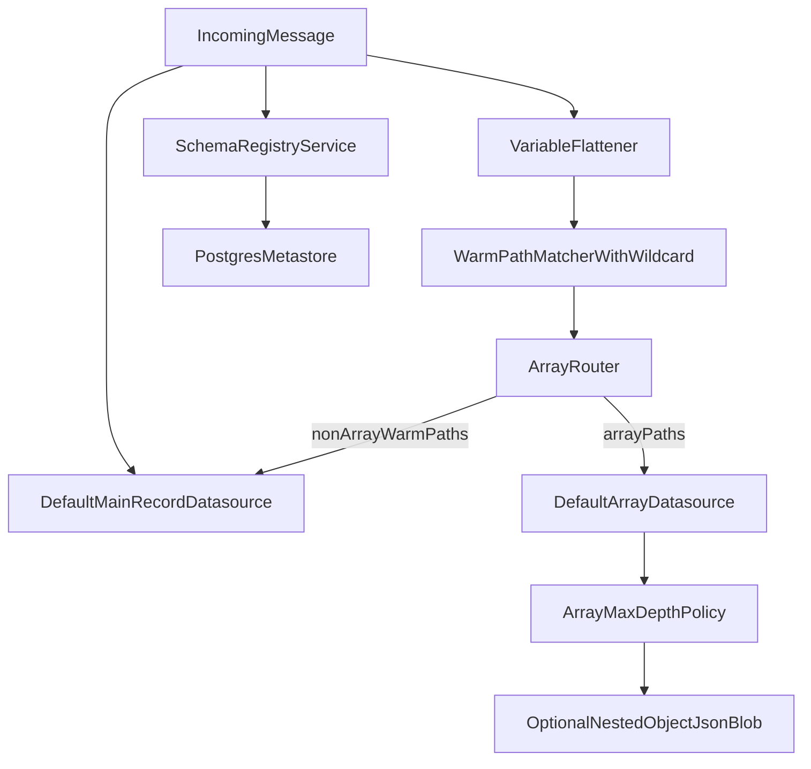

# План проработки и реализации стратегии

## 1) Зафиксировать целевую модель (default как единственная стратегия)
- Оставить `default` единственной runtime-стратегией в [Application.kt](/home/oleg/parser/work_parser/src/main/kotlin/ru/sber/parser/Application.kt): убрать ветки `hybrid`, `eav`, `combined`; оставить совместимый CLI алиас для `compcom` (временно) с предупреждением о депрекации.
- Сохранить обязательные верхнеуровневые поля по текущей модели [BpmMessage.kt](/home/oleg/parser/work_parser/src/main/kotlin/ru/sber/parser/model/BpmMessage.kt), без ослабления non-null контракта.
- Зафиксировать, что основной datasource остается `default` (текущий `default_process_default`) через [DruidDataSources.kt](/home/oleg/parser/work_parser/src/main/kotlin/ru/sber/parser/druid/DruidDataSources.kt).

## 2) Встроить warm-пути и wildcard-мэтчинг в default
- Перенести в `default` поведение warm-фильтрации из `compcom`/`combined`: `tier2WarmCategories`, wildcard `[*]`, path-matching, лимит warm-переменных.
- Источники логики: [CompcomStrategy.kt](/home/oleg/parser/work_parser/src/main/kotlin/ru/sber/parser/parser/strategy/CompcomStrategy.kt), [CombinedStrategy.kt](/home/oleg/parser/work_parser/src/main/kotlin/ru/sber/parser/parser/strategy/CombinedStrategy.kt), [FieldClassification.kt](/home/oleg/parser/work_parser/src/main/kotlin/ru/sber/parser/config/FieldClassification.kt).
- Важно: warm-поля для `variables` и ниже использовать как в compcom, но сохранять в экосистеме `default` (главная запись в default datasource + специализированный datasource для массивов, см. следующий шаг).

## 3) Перевести все массивы на compcom-подход с отдельным datasource
- Добавить для default дополнительный datasource для array-records (по аналогии с `compcom_process_variables_indexed`).
- Для всех массивных путей `variables.*` сохранять элементы как нормализованные записи в отдельный datasource, а не как “широкие” колонки main-таблицы.
- Использовать существующий flatten-пайплайн из [VariableFlattener.kt](/home/oleg/parser/work_parser/src/main/kotlin/ru/sber/parser/parser/VariableFlattener.kt), но маршрутизацию массивов делать в отдельную запись/поток ingestion.

## 4) Добавить конфиг глубины вложенности для массивов
- В `parser`-конфиг добавить параметр наподобие `arrayMaxDepth` (и, при необходимости, отдельный режим поведения при превышении: skip/truncate/blob-only).
- Применить лимит в обходе nested `List/Map` для array-контекста (не ломая существующую обработку обязательных top-level полей).
- Обновить [config.yaml](/home/oleg/parser/work_parser/src/main/resources/config.yaml) и загрузку конфигурации в [AppConfig.kt](/home/oleg/parser/work_parser/src/main/kotlin/ru/sber/parser/config/AppConfig.kt).

## 5) Добавить JSON blob для вложенных объектов массивов
- В array datasource добавить поле `value_json` (или аналог) для сериализации вложенных объектов/поддеревьев массива по конфигу.
- Поддержать комбинированный режим: leaf-индексация + blob (для сложных nested object), чтобы не терять аналитическую фильтрацию и одновременно сохранять полный контекст.
- Серилизацию делать детерминированной (канонический JSON), чтобы упростить сравнение/тестирование.

## 6) Очистить кодовую базу от лишних стратегий
- Удалить неиспользуемые реализации и их wiring: [HybridStrategy.kt](/home/oleg/parser/work_parser/src/main/kotlin/ru/sber/parser/parser/strategy/HybridStrategy.kt), [EavStrategy.kt](/home/oleg/parser/work_parser/src/main/kotlin/ru/sber/parser/parser/strategy/EavStrategy.kt), [CombinedStrategy.kt](/home/oleg/parser/work_parser/src/main/kotlin/ru/sber/parser/parser/strategy/CombinedStrategy.kt).
- Обновить документацию/скрипты/манифесты запросов: [strategies.md](/home/oleg/parser/work_parser/strategies.md), [run-all-strategies.sh](/home/oleg/parser/work_parser/scripts/run-all-strategies.sh), [query-manifest.json](/home/oleg/parser/work_parser/scripts/query-manifest.json), каталоги `query/*`.
- Оставить только актуальные query-наборы для новой default-стратегии.

## 7) Сохранить текущую работу со схемой и Postgres metastore
- Не менять контур: [SchemaRegistryService.kt](/home/oleg/parser/work_parser/src/main/kotlin/ru/sber/parser/metastore/SchemaRegistryService.kt), [SchemaExtractor.kt](/home/oleg/parser/work_parser/src/main/kotlin/ru/sber/parser/metastore/SchemaExtractor.kt), [PostgresSchemaMetastoreRepository.kt](/home/oleg/parser/work_parser/src/main/kotlin/ru/sber/parser/metastore/PostgresSchemaMetastoreRepository.kt).
- Проверить, что новая array-репрезентация корректно отражается в schema binding и не ломает canonical hash.

## 8) Тестирование и нагрузочные сценарии
- Добавить unit-тесты для новой default-стратегии: warm path matching, array datasource routing, depth limit, JSON blob fallback.
- Расширить генератор сообщений массивами высокой сложности в [MessageGenerator.kt](/home/oleg/parser/work_parser/src/main/kotlin/ru/sber/parser/generator/MessageGenerator.kt) и тесты в [MessageGeneratorTest.kt](/home/oleg/parser/work_parser/src/test/kotlin/ru/sber/parser/generator/MessageGeneratorTest.kt):
  - много массивов в одном сообщении;
  - разная глубина вложенности;
  - массивы примитивов, объектов и mixed;
  - nested arrays в объектах массивов.
- Добавить/обновить интеграционные проверки ingestion и datasource existence в [DruidIntegrationTest.kt](/home/oleg/parser/work_parser/src/test/kotlin/ru/sber/parser/integration/DruidIntegrationTest.kt).

## 9) Пошаговое внедрение (минимизация риска)
- Этап A: feature-flag для новой array-логики внутри default.
- Этап B: dual-run (старая и новая запись в тестовом контуре), сравнение количества записей/ключевых метрик.
- Этап C: переключение по умолчанию, затем удаление legacy-стратегий.
- Этап D: зачистка технического долга (docs, scripts, неактуальные тесты, query assets).

## Критерии готовности
- Единственная поддерживаемая стратегия: `default` (с новым warm/array поведением).
- Все массивы пишутся в отдельный datasource.
- Глубина вложенности массивов конфигурируема и покрыта тестами.
- Для вложенных объектов массивов доступен JSON blob режим.
- Schema parsing + Postgres metastore работают без изменений по контракту.
- Генератор и тесты подтверждают устойчивость на сообщениях с большим количеством массивов и разной вложенностью.
