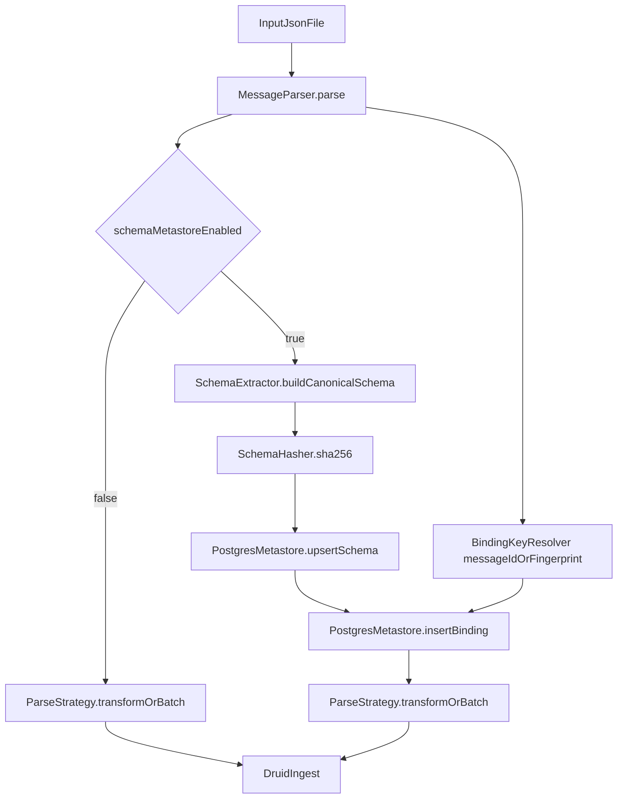

---

name: Message schema metastore
overview: Добавить в Kotlin-пайплайн опциональный PostgreSQL metastore для хранения только новых схем входящих сообщений и связей схема↔сообщение без изменения payload. Поддержать два режима работы: текущий (без схем) и расширенный (со схемами).
todos:

- id: design-metastore-schema
content: Спроектировать DDL таблиц message_schema и message_schema_binding, индексы и ограничения уникальности
status: pending
- id: implement-schema-fingerprint
content: Реализовать рекурсивный extractor/canonicalizer схемы и SHA-256 fingerprint с проверкой коллизий
status: pending
- id: add-postgres-repository
content: Добавить Kotlin-слой metastore репозитория и upsert/insert binding транзакции
status: pending
- id: wire-into-pipeline
content: Встроить двухрежимный pipeline: базовый (без metastore) и расширенный (с SchemaRegistryService)
status: pending
- id: add-feature-toggle
content: Добавить конфигурацию feature flag для включения/отключения metastore схем и условной инициализации PostgreSQL
status: pending
- id: tests-unit-integration
content: Покрыть unit и integration тестами (включая конкурентные upsert и fallback binding)
status: pending
isProject: false

---

# План реализации metastore схем сообщений

## Цель

Сохранять только **новые** схемы входящих сообщений (полная рекурсивная схема JSON), хранить связь схема↔сообщение без изменения исходного сообщения и поддержать **2 режима пайплайна**: исходный и со схемами (Kotlin).

## Что меняем

- Добавляем новый слой `metastore` (отдельно от Druid):
  - интерфейс репозитория и сервис регистрации схем;
  - PostgreSQL-реализация с upsert/транзакцией;
  - конфиг подключения в [config.yaml](/home/oleg/parser/work_parser/config.yaml) и [AppConfig.kt](/home/oleg/parser/work_parser/src/main/kotlin/ru/sber/parser/config/AppConfig.kt).
- Встраиваем вызов регистрации схемы в оркестрацию обработки после парсинга и до трансформации в [Application.kt](/home/oleg/parser/work_parser/src/main/kotlin/ru/sber/parser/Application.kt), но только при включенном флаге.

## Два пайплайна (через конфигурацию)

- `schemaMetastore.enabled=false` (режим по умолчанию):
  - работает текущий pipeline без изменений поведения;
  - компоненты PostgreSQL не инициализируются и коннект не создается.
- `schemaMetastore.enabled=true`:
  - включается регистрация схем и запись binding;
  - инициализируется PostgreSQL-клиент/пул и слой `metastore`.

Рекомендуемая структура конфига:

- `schemaMetastore.enabled: Boolean`
- `schemaMetastore.postgres.host/port/database/user/password` (или `jdbcUrl`)
- `schemaMetastore.postgres.pool.`* (минимум `maxPoolSize`, `connectionTimeoutMs`)

## Модель данных PostgreSQL

- Таблица `message_schema`:
  - `id` (bigserial PK)
  - `schema_hash` (char(64), SHA-256)
  - `hash_algo` (text, default `sha256`)
  - `canonical_schema` (jsonb) — каноническое представление схемы
  - `schema_version` (int, default 1)
  - `first_seen_at` (timestamptz)
  - `last_seen_at` (timestamptz)
  - `seen_count` (bigint)
  - уникальный индекс: (`schema_hash`, `hash_algo`, `schema_version`)
- Таблица связи `message_schema_binding`:
  - `id` (bigserial PK)
  - `schema_id` (FK -> `message_schema.id`)
  - `binding_type` (`message_id` | `fingerprint`)
  - `message_id` (nullable text)
  - `message_fingerprint` (nullable char(64))
  - `source` (text, например file path/topic)
  - `received_at` (timestamptz)
  - индексы по `message_id`, `message_fingerprint`, `schema_id`
  - уникальные ограничения:
    - (`binding_type`, `message_id`) where `message_id` is not null
    - (`binding_type`, `message_fingerprint`, `source`) where `message_fingerprint` is not null

## Привязка схемы к сообщению (выбранный вариант)

Комбинированная стратегия:

- если в сообщении есть стабильный идентификатор — пишем binding типа `message_id`;
- иначе fallback на `message_fingerprint` (SHA-256 от канонического JSON payload/сырого текста + source).

Это не требует изменения payload и покрывает оба сценария.

## Алгоритм извлечения и уникальности схемы

1. Десериализованный JSON -> построение рекурсивной схемы:
  - объект: map `fieldName -> fieldSchema`
  - массив: `array<elementSchema>`; для неоднородных массивов — `union`/merged-type
  - примитивы: `string|number|integer|boolean|null`
2. Канонизация:
  - детерминированная сортировка ключей;
  - нормализация представления типов (например, integer/number правила);
  - сериализация в стабильный canonical JSON.
3. Fingerprint:
  - `schema_hash = SHA-256(canonical_schema_json)`.
4. Upsert:
  - вставка новой схемы по уникальному индексу;
  - при конфликте обновление `last_seen_at`, `seen_count = seen_count + 1`.
5. Защита от крайне редких коллизий:
  - после попадания по `schema_hash` выполняем проверку `canonical_schema` на равенство;
  - при несовпадении — логируем collision и сохраняем запись с `schema_version+1` (или с доп. salt), чтобы не смешать разные схемы.

## Почему хеши здесь оптимальны

- Прямое сравнение больших `jsonb` как ключа уникальности дороже по CPU/индексам.
- Хеш даёт компактный индекс и быстрый upsert на высоком потоке.
- Коллизии практически нереальны для SHA-256, а дополнительная проверка `canonical_schema` полностью снимает риск ложного совпадения.

## Поток данных (встраивание в текущий пайплайн)

## Ключевые файлы для реализации

- [Application.kt](/home/oleg/parser/work_parser/src/main/kotlin/ru/sber/parser/Application.kt)
- [AppConfig.kt](/home/oleg/parser/work_parser/src/main/kotlin/ru/sber/parser/config/AppConfig.kt)
- [build.gradle.kts](/home/oleg/parser/work_parser/build.gradle.kts)
- Новый пакет: `/home/oleg/parser/work_parser/src/main/kotlin/ru/sber/parser/metastore/*`
  - `SchemaExtractor.kt`
  - `SchemaCanonicalizer.kt`
  - `SchemaHasher.kt`
  - `SchemaMetastoreRepository.kt`
  - `PostgresSchemaMetastoreRepository.kt`
  - `SchemaRegistryService.kt`

## Проверка и тесты

- Unit:
  - при `enabled=false` путь выполнения полностью совпадает с текущим pipeline (без вызовов metastore);
  - при `enabled=true` вызывается полный поток регистрации схем;
  - одинаковые payload (разный порядок полей) -> один `schema_hash`;
  - разные схемы -> разные hash;
  - mixed/nullable arrays и вложенные объекты;
  - fallback binding на fingerprint.
- Integration (Testcontainers PostgreSQL):
  - конкурентные upsert’ы одной схемы -> одна запись в `message_schema`, корректный `seen_count`;
  - вставка binding с `message_id` и с fallback fingerprint;
  - сценарий collision-guard (мокаем hasher).

